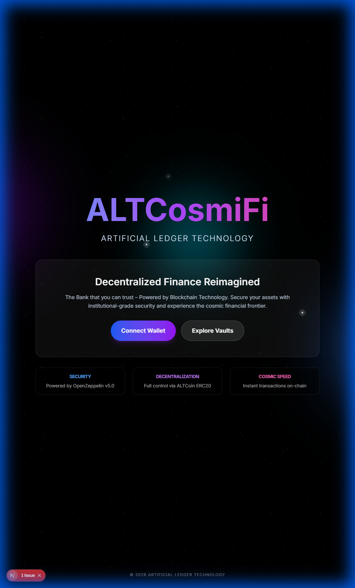
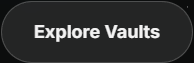

# ALTCosmiFi: Web3 DeFi Application

<div align="center">
  
</div>

## 🚀 Overview

**ALTCosmiFi** (Artificial Ledger Technology CosmiFi) is a cutting-edge **Web3 Decentralized Finance (DeFi)** application designed to bridge the gap between traditional banking and the decentralized world. Powered by blockchain technology, it offers a secure, transparent, and high-speed platform for managing digital assets.

> **Note:** This project represents a significant evolution and transition from our previous roadmap. It serves as the continuation of the work started in [CCPRGG2L_INTERMEDIATE_FINAL_EXAM](https://github.com/flexycode/CCPRGG2L_INTERMEDIATE_FINAL_EXAM).

## ✨ Key Features

*   **Decentralized Banking**: Experience true financial ownership with non-custodial wallets.
*   **Cosmic Speed**: Blazing fast transactions powered by optimized smart contracts.
*   **Bank-Grade Security**: Audited contracts and secure wallet integrations ensure your funds are safe.
*   **Seamless UI/UX**: A modern, immersive interface built for the next generation of finance.

<div align="center">
  
</div>

## 🛠️ Technology Stack

This project is built using the latest modern web and blockchain technologies:

*   **Frontend**: [Next.js](https://nextjs.org/) (React Framework) with Turbopack
*   **Styling**: [Tailwind CSS](https://tailwindcss.com/) for rapid UI development
*   **Blockchain Interaction**: [Ethers.js](https://docs.ethers.org/)
*   **Smart Contracts**: [Hardhat](https://hardhat.org/) for development and testing

## 📦 Getting Started

Follow these steps to set up the project locally:

1.  **Clone the repository**
    ```bash
    git clone https://github.com/flexycode/CCSFEN1L_ALTCosmiFi.git
    cd CCSFEN1L_ALTCosmiFi
    ```

2.  **Install dependencies**
    ```bash
    npm install
    ```

3.  **Run the development server**
    ```bash
    npm run dev
    ```

4.  Open [http://localhost:3000](http://localhost:3000) with your browser to see the result.

## 📜 History & Credits

This repository is the successor to the **Intermediate Programming Final Exam** project. As we transition into the world of Web3, we carry forward the principles of clean code and robust architecture.

*   **Original Repository**: [CCPRGG2L_INTERMEDIATE_FINAL_EXAM](https://github.com/flexycode/CCPRGG2L_INTERMEDIATE_FINAL_EXAM)
*   **Team**: Artificial Ledger Technology (ALT)

---
*Built with 💙 by the ALT Team*


